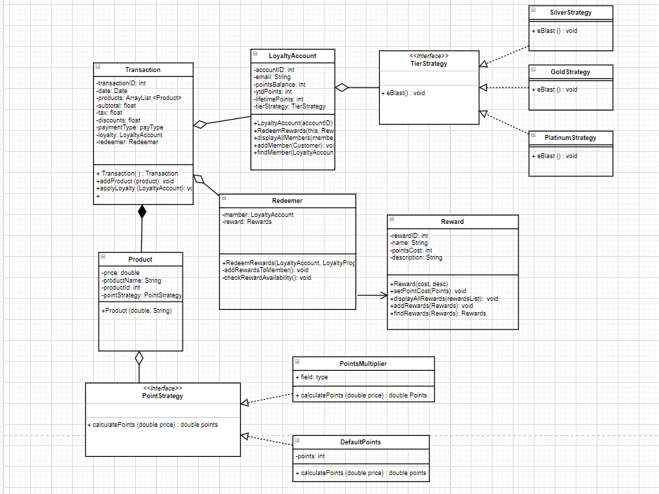
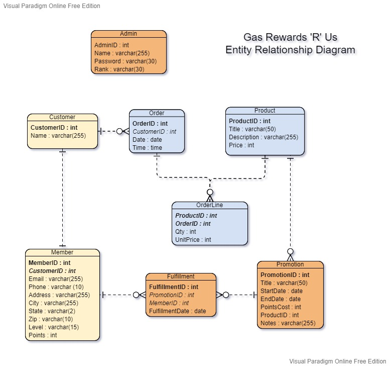
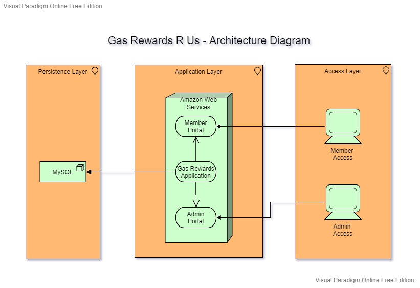

# GasRUs
## Overview
GasRUs is a gas station loyalty program dedicated to bringing rewards to our valued customers!

## Architecture
### UML Diagram

### Logical Architecture Diagram

### Database Diagram

## Features
Valued GasRUs loyalty members can look forward to gaining points just by buying products! The more a member spends, the better the rewards. Our Silver, Gold, and Platinum tiers will reward entice members to spend more in order to get the best promotions! 

General managers of all GasRUs locations will also be happy with our application. With the click of a button, rewards can be added, updated, or removed! Loyalty member accounts can also be tracked via an interactive dashboard. Not sure if a new promotion is going well? Check the loyalty member dashboard to see if loyalty members are spending! 

## Built with
* Java Spring Boot
* AngularJS
* MySQL

## Authors
* Ahmad Shabaneh
* Keith Irwin
* Drew Freeman
* Curtis Hunt
* Alayna Buysse
